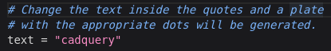
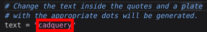

# Generate

## Open the Braille Sign {pagestep: open}

* Open the design in CadHub.xyz by right clicking [this link](https://cadhub.xyz/dev-ide/cadQuery#fetch_text_v1=https://github.com/7B-Things/braille-signage-generator/blob/main/braille_signage_generator.py) and opening in a new tab.
* The default braille sign should generate within 30 seconds or so. If it does not, click the _Render_ button to re-render it.

## Modify the Braille Sign {pagestep: modify}

* There is a variable at the top of the model script which is called `text`.

* Modifying the text inside the quotes will change what braille dots are generated in the model.

## Render the Modified Braille Sign {pagestep: render}

* Click the _Render_ button to generate the sign with the new braille based on the text variable.

* Once the render is complete, it should be possible to rotate, pan and zoom the image in the _Viewer_.
     * Left mouse click and drag to rotate.
     * Mouse wheel click and drag or roll to zoom.
     * Right mouse click and drag to pan.

## Download the Modified Braille Sign {pagestep: download}

* Once the render is complete, the _Download STL_ button can be clicked to download an STL file that can be used with slicer software.

Once the file has been downloaded, move on to the [Print](print.md) step.