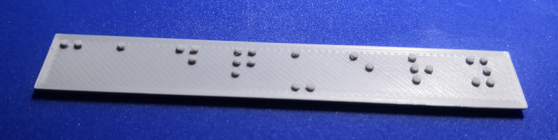
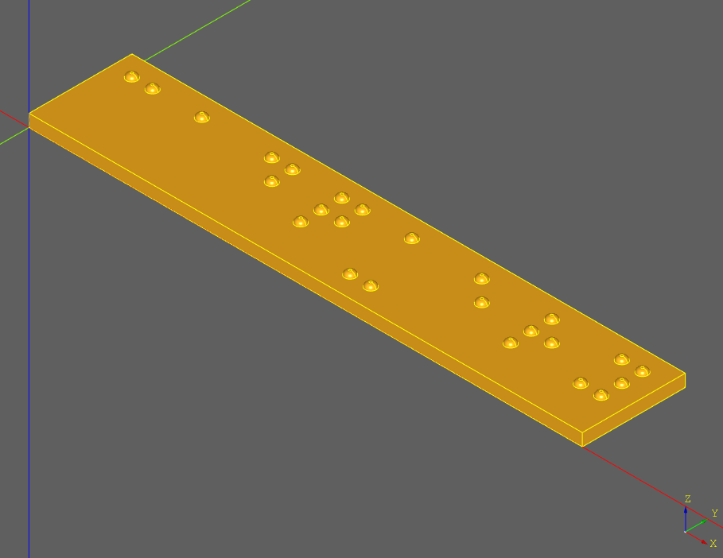

# Braille Signage Generator

## Introduction

The braille signage generator is a script that generates 3D printable braille signage based on user-provided English text. This is a work in progress and may not be standards-compliant or completely correct yet. Regulations also vary by region, so please consult with local authorities to ensure that the dot geometry and spacing provided in this script meets requirements.

This generator attempts to comply with the standards set forth in [American National Standard: Accessible and Usable Buildings and Facilities: 2003: Standard and Commentary](https://bellevuewa.gov/sites/default/files/media/pdf_document/codes_2009ICC_A117.1_read-only.pdf), chapter 7, section 703.4, table 703.4-3 for braille dimensions. These standards may not be compatible with the regulations in your region. Always consult local laws and regulations to determine if this signage will meet requirements.

This design is open hardware, and the [source](https://github.com/7B-Things/braille-signage-generator) needed to reproduce and modify it for your own use is hosted on GitHub. Contributions to improve the generator are welcome.

## Limitations

The generator could be expanded to overcome these limitations in the future, but are current limitations nonetheless.

* Targets only a single United States braille standard.
* Supports only a single line of braille text.
* Only generates uncontracted (grade 1) braille.

## Materials Required

If you intend of printing a braille sign, make sure that you have the tools and supplies listed in the [bill of materials]{BOM}.

## Making A Braille Sign

There are three high level steps to creating a braille sign, and separate docs for them are listed below. There is also an optional step for post-processing the 3D print to get the best quality. The first step is to generate an STL with custom braille text, and the second is to print that plate with settings that will result in a sign with acceptable quality.

* [.](generate.md){step}
* [.](print.md){step}
* [.](post_processing.md){step}
