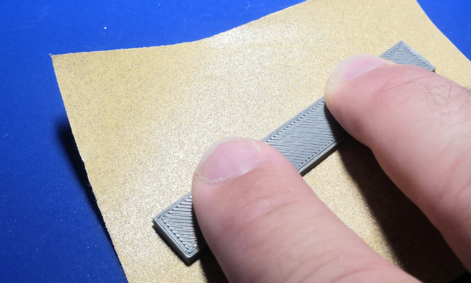
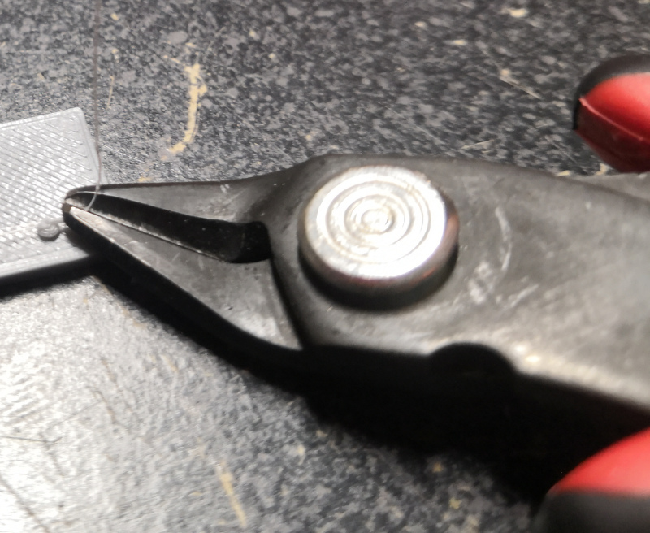
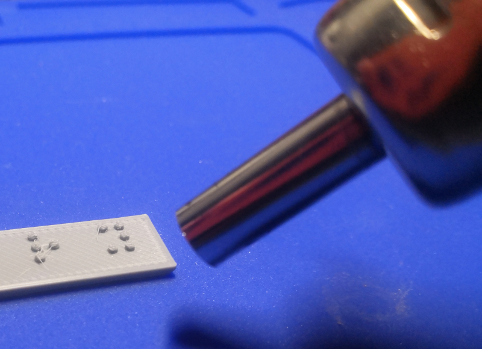
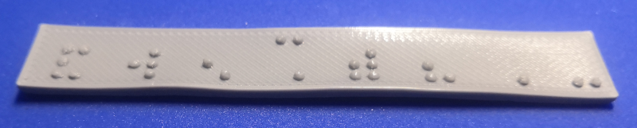

[flush cutters]:Tools.yaml#FlushCutters
[heat gun]:Tools.yaml#HeatGun
[fine grit sandpaper]:Tools.yaml#Sandpaper

# Post Processing

{{BOM}}

## Removing Protrusions from Dots {pagestep: protrusions}

Due to the nature of FDM 3D printing, it is likely that there will be roughness or protrusions on the top of the braille dots that may make them less comfortable to scan with a finger. These protrusions can be removed by placing the braille sign dot side down on a sheet of [fine grit sandpaper]{Qty: 1 sheet, Cat: Tool} and moving it back and forth while gently applying pressure.

It should not require a lot of sanding to make the dots more comfortable to scan. No more than 5 to 10 gentle strokes should be sufficient if your 3D printer settings are set properly (see note below). Be sure to hold the sign level during sanding so that material is removed evenly from the dots.

## A Note About Additional Methods

Before relying on the additional methods below to finish braille signs, be sure that your filament is free of excess moisture and experiment with your 3D printer's settings, including the following, to try to reduce or remove stringing.

* Nozzle temperature
* Retraction distance
* Retraction lift
* Axis movement speed

String removal can greatly increase the time it takes to produce a sign, and can lead to deformation of dots and/or the sign's base plate. It is worth spending some time to try to dial in your 3D printer settings to avoid stringing.

## Clipping Strings (Optional) {pagestep: clipping}

* Initial cleanup of strings can be done with a pair of [flush cutters]{Qty: 1, Cat: Tool, Note: '(Optional)'} or side cuts.
    * Take care not to deform or cut off the dots during this process.

* A fine triangle file can also work for removing larger excess deposits of plastic, but can easily damage dots as well.

## Heat Gun Method (Optional) {pagestep: heat_gun}

* A [heat gun]{Qty: 1, Cat: Tool, Note: '(Optional)'} can be carefully used to remove the minor occurrences of stringing that occur when printing the dots (example guide [here](https://www.fabbaloo.com/blog/2017/12/8/pro-tip-an-easy-way-to-remove-stringies-from-your-3d-print)).
    * Never hold the part being de-stringed in your hand while applying heat.
    * Never put the part being de-stringed on a flammable surface while applying heat.
    * Follow all safety instructions supplied by the manufacturer of your heat gun.

* Start with the heat gun away from the part and move it inwards slowly.
* Do not dwell in one area for too long.
* It is easy to put too much heat into the base plate and causing warping, or to melt and deform the dots. This method requires practice to be able to do it well.

