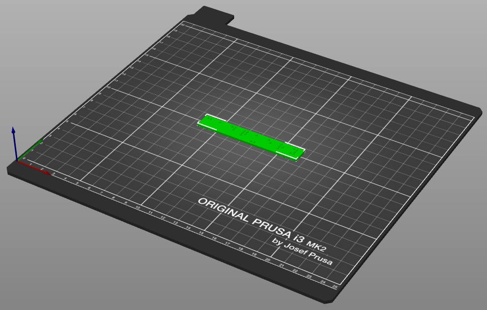
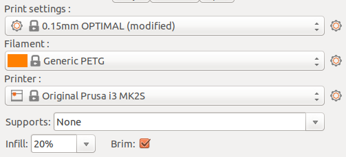
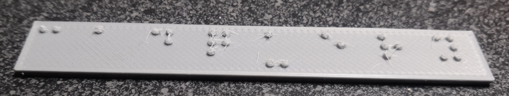

[3D printer]:Tools.yaml#Printer
[slicer software]:Tools.yaml#SlicerSoftware
[PLA filament]:Parts.yaml#PLAFilament
[PETG filament]:Parts.yaml#PETGFilament

# Print

In order to work better for 3D printing, the dimensions of each braille dot has been set to the maximum allowed. This can cause the dots to be oversized on 3D printers with insufficient dimensional accuracy. Printing with anything larger than a 0.4 nozzle will likely lead to print quality problems as well. The braille dots are very small compared to the resolution that most 3D printers are capable of printing to, and so finer detail settings must be used when slicing the software.

{{BOM}}

## Slice the Braille Sign {pagestep}

* Load the STL downloaded from CadHub.xyz into your choice of [slicer software]{Qty: 1, Cat: tool}.
* Ensure that the braille plate is positioned so that the flat side will be printed on the bed of the 3D printer, with the dots on the top side.

* Make sure that the layer height is set to 0.15 mm or as close to that as possible.
* Ensure that the appropriate material is set in the slicer (PETG if you are using the recommended material)
* Supports should be disabled as they are not needed.
* Any infill of 20% or higher should work.
* Printing with a brim/skirt is recommended, especially when printing in PLA, to make sure the plate stays flat on the print bed during printing.

## Print the Braille Sign {pagestep}

* Make sure that at least 0.7 meters of [PETG filament]{Qty: 0.7 m, Note: " - PLA has been tested as well, and other filaments may work but have not been tested."} is available for the print, more if more characters were used than the default "cadquery" text.
* Use the [3D printer]{Qty: 1, Cat: tool} to print the braille sign.
* Remove the braille sign from the print bed, taking care not to damage the braille dots in the process.

Due to the close positioning and small size of the braille dots, stringing is possible and may require some post-processing to clean the dots up to an acceptable level. It may also be possible to reduce or eliminate stringing by adjusting the nozzle temperature and retract settings for your printer. If strings are observed on the print see the [post-processing](post_processing.md) instructions for information on how to clean the dots up.